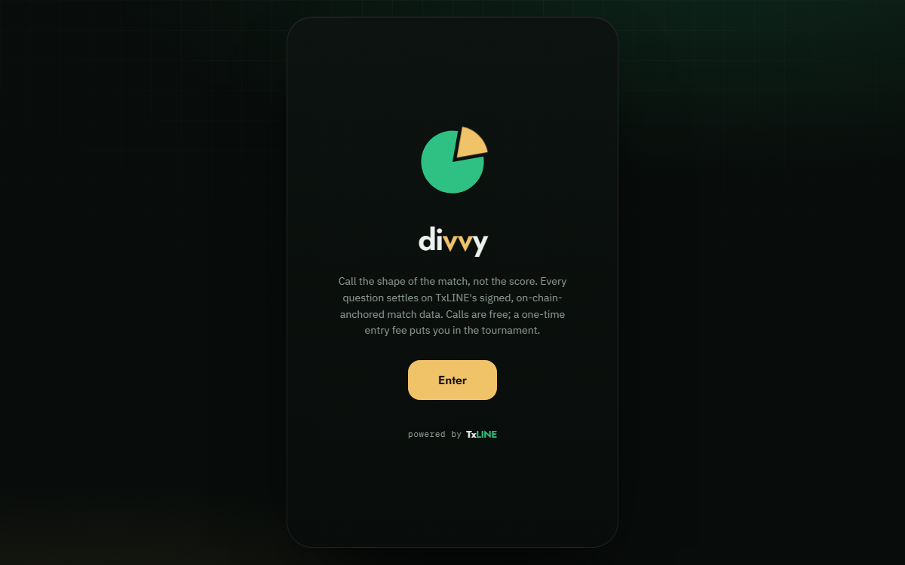

# block ballr

maker _

## Projects

- **[Divvy](https://divvyplay.club)**: an on-chain sports prediction game. Call the shape of the match, not the score; every question settles on signed, on-chain-anchored match data. Calls are free, and a one-time entry fee puts you in the tournament.

  

- **HandGloss**: A **Speech → ASL engine**.
  - An experiment in making communication more accessible. Everything runs in-browser
  - _(If you're on mobile, change to desktop view)_. **[Interact](https://handgloss.vercel.app/)**
- **[Radar](https://github.com/blockballr/Radar)**: a free Solana screener and signal agent on Telegram.

## Focus

Agentic engineering and LLM-driven tools.

## Reach me

- X: [@blockballr](https://x.com/blockballr)
